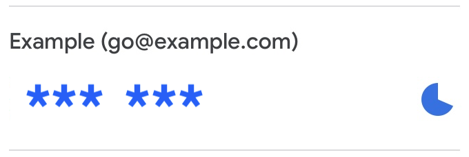

# Time-based One-Time Password (TOTP)
Implementation of TOTP ([RFC6238](https://datatracker.ietf.org/doc/html/rfc6238)) authentication and QR code generator

 

> \* These QR code and account are exmaples. **DO NOT** open your real private key to the public.

## Requirements
- [Docker](https://www.docker.com)
- [GNU Make](https://www.gnu.org/software/make/)

## Installation
Before installation, you must meet requirements.
```sh
$ cd totp
$ make build
```

## How to use
Scan the generated QR code (`./qrcode/qr.png`) by [Google Authenticator](https://github.com/google/google-authenticator) etc.
```sh
$ make run

# Generate QR code and authenticate TOTP
$ go run main.go
```

## Implemented Commands
The commands are implemented by Makefile.

### Build Docker image
```sh
$ make build
```

### Run Docker container
```sh
$ make run
```
